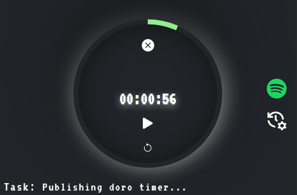
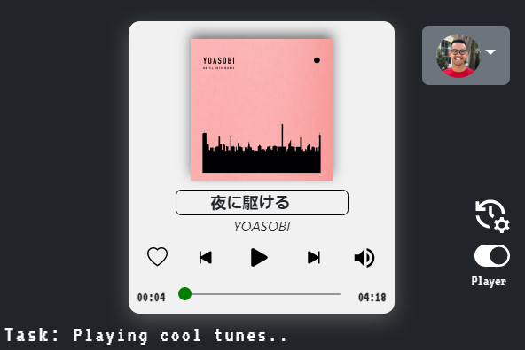

# Doro - Pomodoro Timer with Spotify Player

## Description

- React typescript chrome extension for time management and music playback.

## Features

- Spotify playback commands:
  - Play/pause track
  - Previous/next track
  - Save/unsave track
  - Seek track
  - Volume control
- Pomodoro timer commands:
  - Play/Pause timer
  - Clear timer
  - Reset timer
  - User input for hours, minutes, and focus description
  - Desktop notification when timer complete

## Reasoning for Project

Initially, I wanted to learn about creating a simple chrome extension, which was a pomodoro app. However, it was fairly easy to build since I've learned basic react and web development. So to make things more challenging, I ventured to learn new technologies, including typescript and webpack. 

Eventually, the pomodoro app was expanded to include Spotify when I thought music would be complementary to a timer app. When I researched there was no such application in the Chrome store, I thought I had to build it. Then, Doro was born.  

## API

- Front-end library: [ReactJS](https://reactjs.org/)
- Front-end framework: [Bootstrap](https://icons.getbootstrap.com/)
- TypeScript bundler: [Webpack](https://webpack.js.org/)
- Spotify library: [Spotify Web API](https://developer.spotify.com/documentation/web-api/reference/#/)
- Chome extension API: [Chome API Reference](https://developer.chrome.com/docs/extensions/reference/)
- Testing library: [React Testing Library](https://testing-library.com/docs/react-testing-library/intro/)

## Future Tasks

- Submit Spotify quota extension request
- Publish extension to chrome web store
